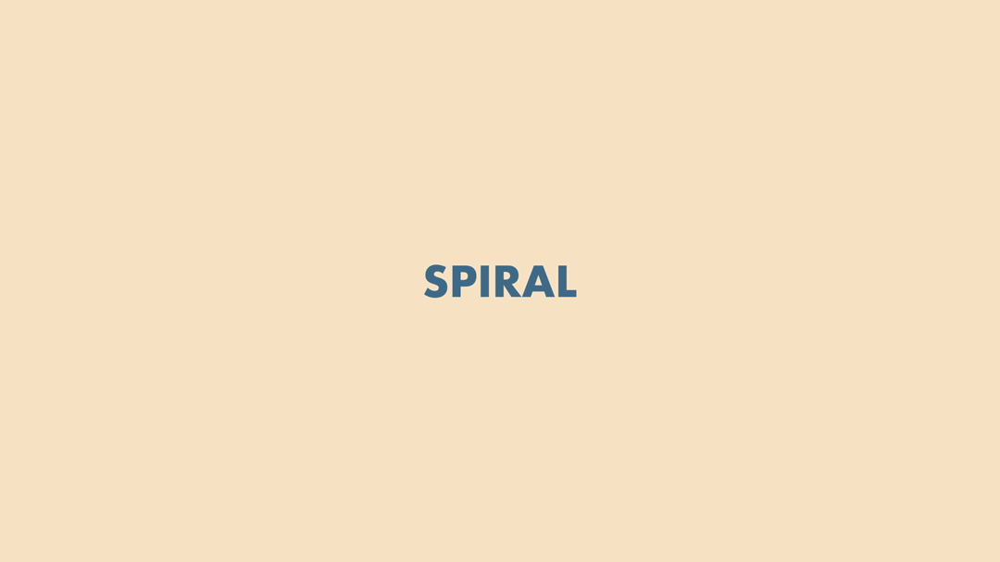
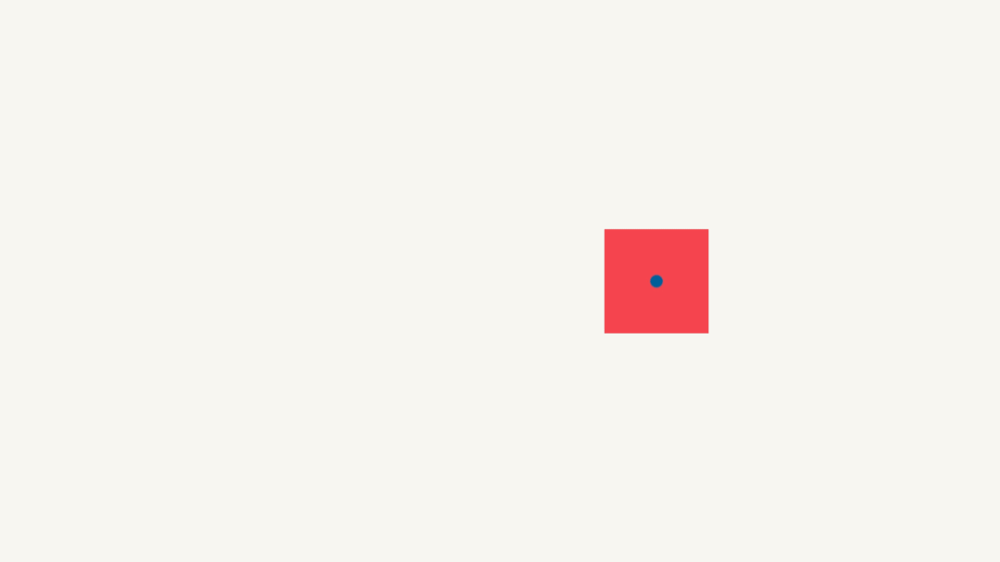
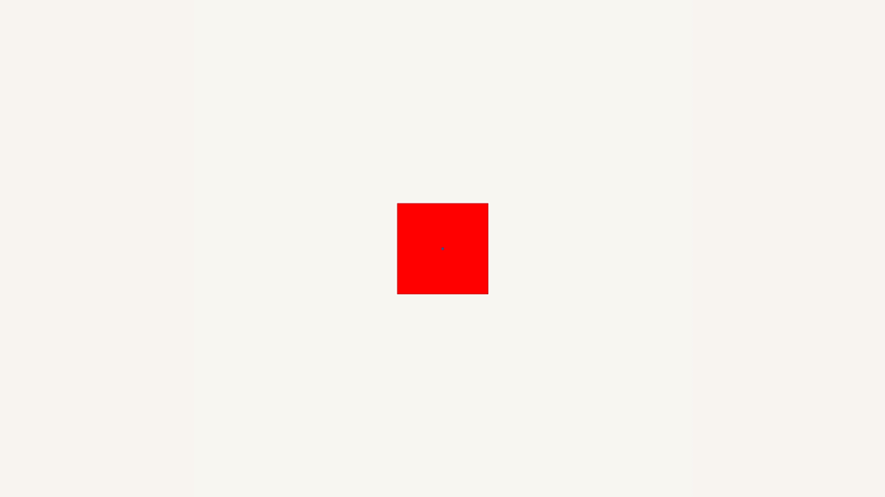
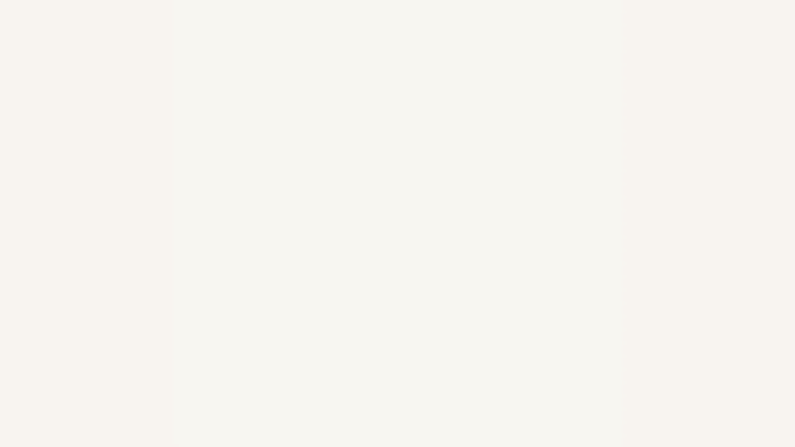

This summer I’ve been taking the time to do more research on expressions. I haven’t made too many new projects but I did figure out a neat expression on how to move things in a spiral motion path. Each of these expressions goes into the position property.  In order to show movement for the sake of this post, I added the write on effect which is the blue trailing line.

I started off with a line of code I found in the book The Power of Expressions by by Francois Lefebvre. This expression was showing how you can use Sin() and cos() to create movement. In this particular example a circle.


```javascript
x = thisComp.width/2;
y = thisComp.height/2;
radius = 300;

[x+Math.cos(time)*radius, y+Math.sin(time)*radius]
```

In this expression the x and y are placed directly in the center of the composition. This is the center point of the circle. To make a circle it needs a radius so we create a variable called radius and we assign it 300 pixels. so the circle will be 300 pixels from that center point we assigned using the x and y value.

I thought then what if I wanted to make a spiral and I came up with this:



```javascript
x = 540;
y = 540;
radius = time*8;

[x+Math.cos(time)*radius, y+Math.sin(time)*radius]
```

My composition size is 1080x1080 and I assigned the x and y values to have the object start spiraling from the center of my composition. From there I created a radius that would increase by time and multiplied it by 8.

Taking it a bit further I found one was in the form of a fibonnaci spiral



```javascript
*Initial script*
x = thisComp.width/2;
y = thisComp.height/2;
radius = 900/(time+1);

[x+Math.cos(time)*radius, y+Math.sin(time)*radius]


*Final Script*
x = transform.position[0];
y = transform.position[1];
radius = 400/(time+1);

[x+Math.cos(time)*radius, y+Math.sin(time)*radius]

```


I initially assigned the x and y values in the center of the composition but the spiral started off the composition. I wanted it to be able to start wherever the object was so I just made the x and y values their position inputs by assigning it transform.position[]. For this expression I also had to add +1 to time because you can’t have a zero radius. (If we start at the beginning of the comp time is 0, and when we divide 900 by 0 it’s zero which causes an error.)

Instead of multiplying the radius like the spiral above, I divided it by time + 1 creating a smaller and smaller radius.


Hope this was a fun little expression snippet for you and excited to see what you do with it!

For more tips and tricks follow my [youtube](https://www.youtube.com/channel/UC4iBjzsAQ8o9HJ1H6dEsCFQ) and on [instagram](https://www.instagram.com/courtneypure/)!
